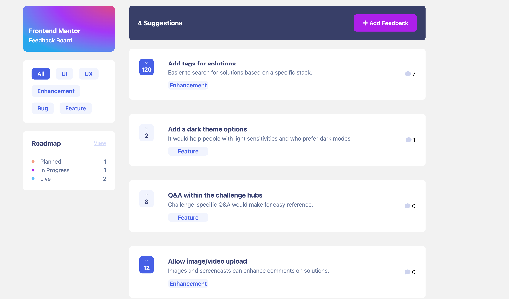
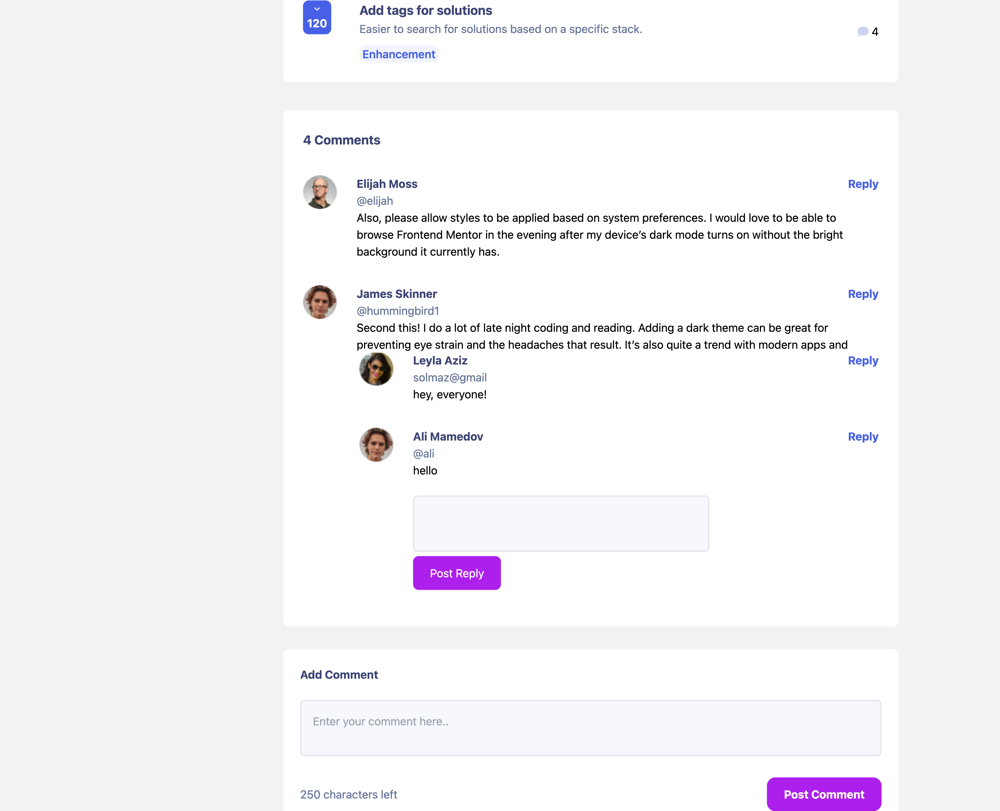
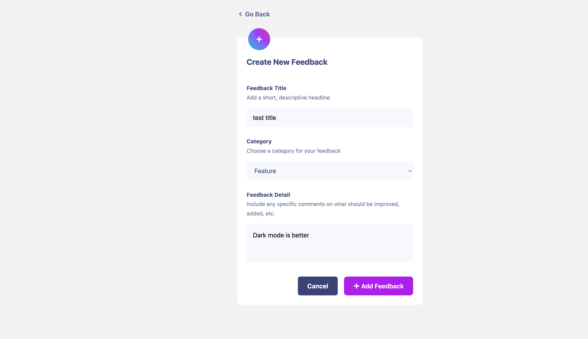
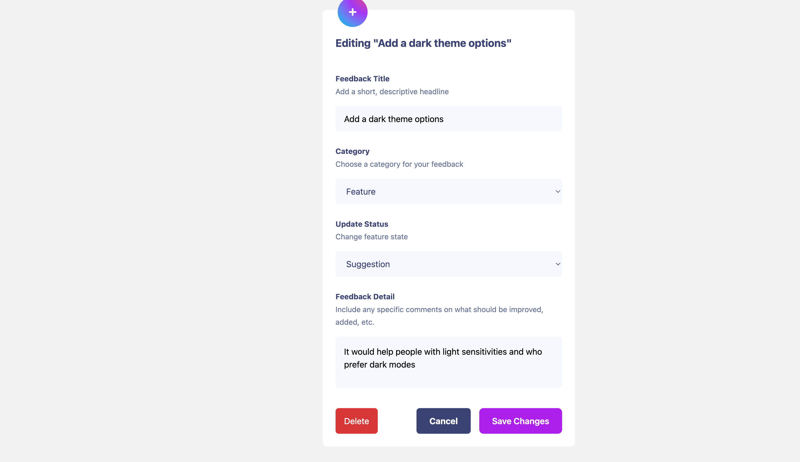
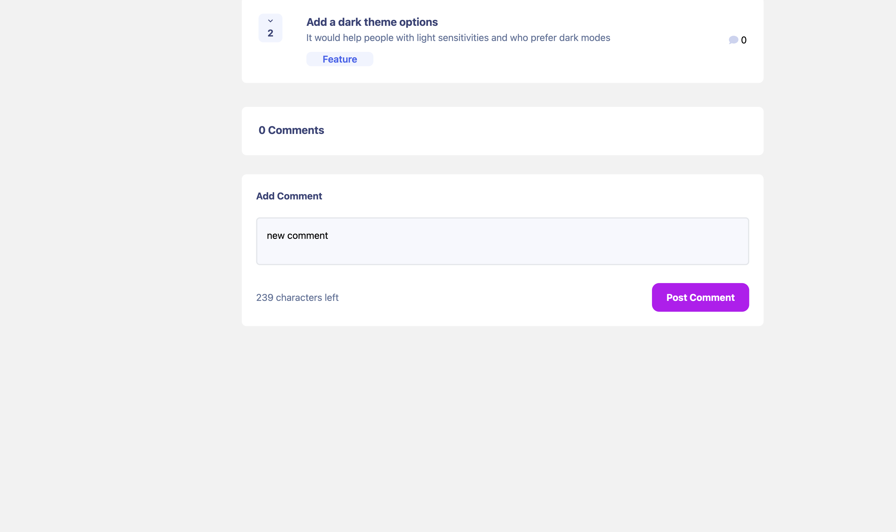
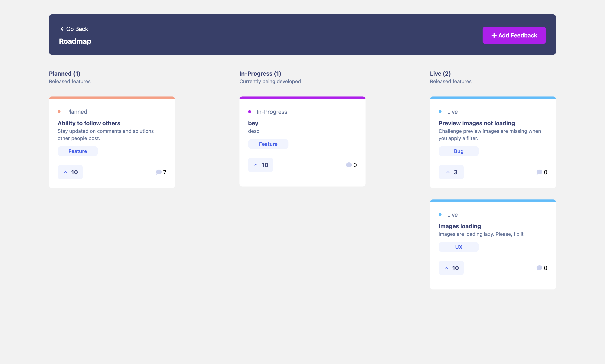

# Frontend Mentor - Product feedback app solution

### This is a solution to the Product feedback app challenge on Frontend Mentor. Frontend Mentor challenges help you improve your coding skills by building realistic projects.

## Table of Contents

<ul>
<li>
<a href="#overview">Overview</a>
</li>
<li>
<a href="#screenshots">Screenshots</a>
</li>
<li>
<a href="#technologies">Technologies</a>
</li>
<li>
<a href="#setup">Setup</a>
</li>
</ul>

# Overview

<ul>
<li>
 View the optimal layout for the app depending on their device's screen size</li>
<li>
See hover states for all interactive elements on the page
</li>
<li>
 Create, read, update, and delete product feedback requests
</li>
<li> Receive form validations when trying to create/edit feedback requests</li>
<li> Filter suggestions by category
</li>
<li> Add comments and replies to a product feedback request
</li>
<li> Upvote product feedback requests
</li>
</ul>

# Screenshots








# Technologies

- Semantic HTML5 markup
- React Js
- Formik (Yup)
- React Router
- TanStack Query v4
- Tailwind Css

# Installation

```bash
npm i

```

# Setup

Start using json-server in project by running this command.

```bash
npx json-server --watch ./src/db.json
```

Runs the app in the development mode.
Open http://localhost:3001 to view it in your browser

```bash
npm start
```
